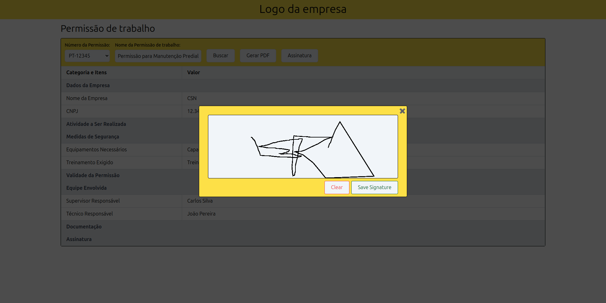

# Permissão de trabalho

## 👀 Como ficou ???

</img>
----------
</img>
----------
</img>
----------
</img>
----------
</img>

## 🧑‍💻 Tecnologias usadas

O projeto foi desenvolvido com as seguintes tecnologias:
- [TypeScript](https://www.typescriptlang.org/)
- [Angular](https://angular.io/)
- [Angular CDK](https://material.angular.io/cdk)
- [Tailwind CSS](https://tailwindcss.com/)

## ⌨️ Sobre o projeto

O projeto consiste em um frontend para um sistema de lista de permissão de trabalho. Ele foi desenvolvido utilizando Angular como framework principal, Tailwind CSS para estilização, e Angular CDK para alguns componentes estruturais.

## 🚀 Rodar o projeto

### 1. Instale as dependências:
Certifique-se de ter o Node.js instalado na sua máquina. Caso não tenha, instale-o [aqui](https://nodejs.org/en/download/).

```bash
npm install
```

### 2. Certifique-se de ter uma API rodando:
A API deve fornecer os seguintes endpoints:

#### Endpoint 1: Obter detalhes de uma permissão de trabalho
**URL:** `/api/permissao/:id`

**Resposta exemplo:**
```json
{
    "numero_permissao": "PT-12345",
    "nome_permissao": "Permissão para Manutenção Predial",
    "itens": [
        {
            "categoria": "Dados da Empresa",
            "item": "Nome da Empresa",
            "valor": "CSN"
        }
    ]
}
```

#### Endpoint 2: Obter uma lista de permissões
**URL:** `/api/permissoes`

**Resposta exemplo:**
```json
[
    "PT-12345",
    "PT-67890",
    "PT-11223"
]
```

Caso não tenha uma API disponível, você pode utilizar mocks ou ferramentas como [JSON Server](https://github.com/typicode/json-server) para simular esses endpoints.

### 3. Inicie o servidor de desenvolvimento:

```bash
npm start
```

### 4. Acesse o projeto no navegador:
Abra [http://localhost:4200](http://localhost:4200) para visualizar o projeto em execução.
